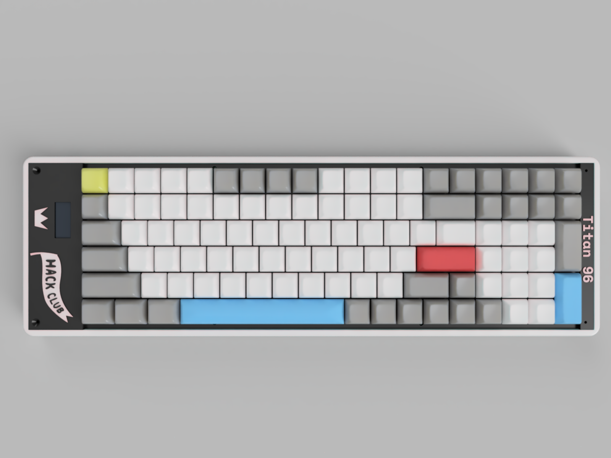

# Titan96  

**Titan96** is a compact 96% low-profile mechanical keyboard designed with sleek aesthetic. Powered by **KMK firmware** and built around the **Orpheus Pico microcontroller** by Hack Club.  

## Features  
- **96% Layout** – Compact yet functional, with all essential keys in a dense layout.  
- **Low-Profile Design** – Slimmer keys and case for a modern, ergonomic feel.  
- **KMK Firmware** – Highly customizable keymaps and macros using CircuitPython.  
- **Orpheus Pico MCU** – A powerful and open-source microcontroller by Hack Club.  
- **100 Keys** – Full numpad and navigation keys.  

## Parts
### CAD

### Schematic

### PCB

## Firmware & Software  
The Titan96 runs on **KMK**, a Python-based keyboard firmware for CircuitPython-compatible microcontrollers.  

### Setup Instructions  
1. **Flash CircuitPython** onto the Orpheus Pico.  
2. **Install KMK firmware** by copying the KMK files to the microcontroller.  
3. **Configure keymap** by editing `code.py` to match your layout.  
4. **Customize macros, layers, and RGB** (if supported) via KMK.  

For detailed KMK setup, refer to the [official KMK documentation](https://github.com/KMKfw/kmk_firmware).  

## Bill of Materials (BOM)  
| Part | Quantity | Notes |  
|------|----------|-------|  
| Orpheus Pico MCU | 1 | Microcontroller by Hack Club |  
| Low-profile mechanical switches | 100 | Gateron Low-Profile |  
| Keycaps | 100 | MX stems |  
| PCB | 1 | Custom Titan96 PCB |  
| Plate | 1 | 3D printed |  
| Case | 1 | 3D printed |  
| Diodes | 100 | 1N4148 |  
| Stabilizers |  | For larger keys (spacebar, Enter, etc.) |  
| OLED Screen 128 x 32 | 1 | Screen |  
| M2 | 5 | To screw the plate into the case |
 

## License  
This project is open-source under the **MIT License**.  

## Extra Renders

